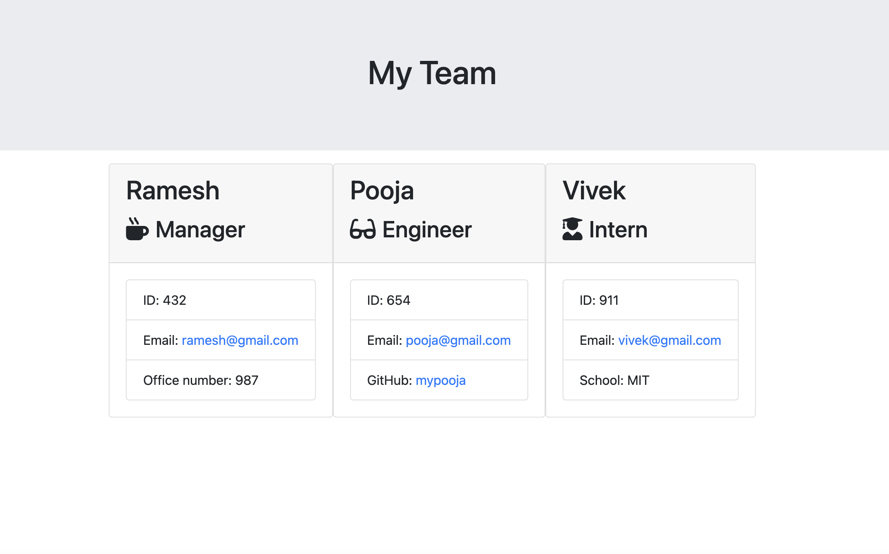

# TeamProfileGenerator
This application generates an HTML webpage that displays information of employees based on user input.

## Description
This is a node.js application which asks user a set of questions to get information about employees in a team. These employees can be Manager, Engineer or Intern. Based on the answers provided by the user, this application generates an HTML webpage that displays the information.

## Installation
`npm init`

## Usage
Run: `node index.js`

Answer all the questions propmted by the application. After answering all the questions a file named `index.html` will be generated in the dist folder of the package.

## Screen captures
### Video
Walkthrough video can be seen [here](./assets/employee-video.webm)

### Screenshot

## Credits

N/A

## License

Please refer to the LICENSE in the repo.
